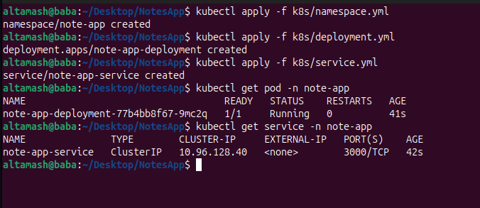

Overview

NoteApp is a lightweight web application that allows users to create, view, and manage notes through a clean interface. The backend, built with 
Node.js and Express, serves a RESTful API, while the frontend uses HTML, CSS, and JavaScript for a responsive experience. 
The app is containerized with Docker and includes Kubernetes manifests for deployment.
Added in  this project CI part by GitAction and CD with the Help of Argocd i setup all the requirements:


Prerequisites:
 - Docker
 - Kubernetes (e.g., KInd or a cloud provider like GKE or AWS)
 - Git

Setup:

1.Clone the repository:
```bash
git clone https://github.com/altamashGit/NoteApp.git
cd NoteApp
```
 To see the file structure you ca type 
 ```
tree
```
you will get as a result


2.Docker Setup:
 - Build the Docker image:
```
docker build -t noteapp:latest .
```


you can see into the terminal Successfully built c
Successfully tagged noteapp:latest

3.Run the container check everything working well or not:
```
docker run -d -p 3000:3000 noteapp:latest
```
Access the app at http://localhost:3000.
In your browser you will get resul as: 


3.Stop and Remove the container 
```
docker ps # To see the running container
docker stop <Container Id> # To stop the Container
docker rm <Container ID> # To remove the container
```
see in the what happing into the screenshot


Kubernetes Deployment

1.Apply the namespace:
```
kubectl apply -f k8s/namespace.yml
```
2.Depploy the application:
```
kubectl apply -f k8s/deployment.yml
```
3.Expose the service:
```
kubectl apply -f k8s/service.yml
```
4.Check that menifest file created successfully Deployment & Service
```
kubectl get pod -n note-app # checking pod is created in the note-app namespace
kubectl get service -n note-app # checking service is created in the note-app namespace
```
See the result into screenshot

4. Port Forwarding
```
kubectl port-forward service/note-app-service -n note-app 3000:3000

```
Access the app via the Kubernetes service URL or on http://localhost:3000.
Final Result


